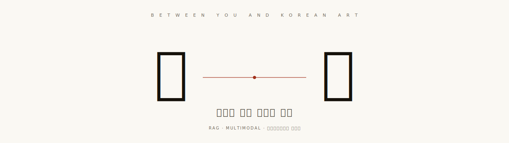

<p align="center">
  <a href="https://wangihong-k-curator.hf.space">
    
  </a>
</p>

<h1 align="center">사이 (SAI) · 작품과 당신 사이를 잇다</h1>

<p align="center">
  국립중앙박물관 큐레이터 해설을 기반으로,<br/>
  <b>박물관 가기 전엔 코스 추천, 가서는 작품 해설, 다녀와선 매일 다른 큐레이션</b>을 보여주는<br/>
  풀스택 RAG·멀티모달 사이드 프로젝트.
</p>

<p align="center">
  <a href="https://wangihong-k-curator.hf.space"></a>
  <a href="./docs/"></a>
  <a href="./LICENSE"></a>
  <a href="https://github.com/dhksrlghd/sai-museum-docent/actions/workflows/build.yml"></a>
</p>

<p align="center">
  
  
  
  
  
  
  
  
  
  
</p>

<p align="center">
  이름 <b>사이</b>는 "사이(in-between)"의 사이. 작품과 당신 사이, 큐레이터의 시선과 관람객 사이, 어제와 오늘 사이를 잇는다는 뜻.
</p>

---

## 미리 보기

> 라이브 사이트에서 캡처한 핵심 화면들. 클릭하면 해당 페이지로 이동.

| 홈 · 매일의 큐레이션 | 코스 빌더 | 작품 상세 + 닮은 작품 |
|:---:|:---:|:---:|
| <a href="https://wangihong-k-curator.hf.space/"></a> | <a href="https://wangihong-k-curator.hf.space/plan"></a> | <a href="https://wangihong-k-curator.hf.space/work/2351292"></a> |
| 30개 테마 day-of-year 회전 | LLM 동선·시간·동반자 톤까지 | CLIP 이미지 유사도 추천 |

> 캡처 이미지가 안 보이면 `docs/images/` 에 아직 추가 전입니다 — `docs/images/.gitkeep` 의 캡처 가이드 참고하시고 채워 넣으면 자동 표시됩니다.

## 무엇이 차별화되는가

대부분의 RAG 데모가 "검색 + LLM 응답" 한 화면짜리에서 끝나는 반면, **사이**는 데이터를
세 갈래로 풀어 실제 관람객 여정에 매핑했어요:

| 사용자 시나리오 | 어디서 답하는가 |
|---|---|
| "1시간만 있어, 외국인 친구한테 한국 미술 정수 보여주고 싶어" | `/plan` — LLM이 작품 4~7점 골라 동선·시간까지 짜줌 |
| "지금 진행중인 특별전 뭐 있어? / 조선 백자는 어디 가야 봐?" | `/exhibitions` + AI 도슨트 (5개 특별전 + 7관 36실 위치) |
| "이 작품과 분위기 비슷한 다른 작품" | 작품 상세 하단 `/work/:id` (CLIP 이미지 임베딩) |
| "기영회도가 뭐야?" 어린이 톤으로 | `/ask` (성인 / 어린이 / 영어 3-mode 시스템 프롬프트) |
| 매일 들어와도 새로운 추천이 보였으면 | 홈 메인 — 30개 테마 풀에서 day-of-year 결정적 회전 |

## 페이지 / 엔드포인트

```
프론트엔드                     백엔드 API
─────────────                ─────────────
/                            GET  /api/today           # 오늘의 테마 + 추천 6점
/plan                        POST /api/plan            # SSE 스트리밍 코스 빌더
/exhibitions                 GET  /api/exhibitions     # 7관 36실 + 특별전
/browse                      GET  /api/works           # 321점 카탈로그
/work/:id                    GET  /api/works/{id}
                             GET  /api/works/{id}/similar  # CLIP 이미지 유사도
/ask                         POST /api/chat            # SSE 3-mode RAG
```

## 데이터 풍경

| 카테고리 | 양 | 출처 |
|---|---|---|
| 큐레이터 추천 작품 | **321점** | 큐레이터 추천 소장품 페이지 (공공누리 3유형) |
| 상설전시 작품 | **643점** | 7관 36실 페이지 |
| 특별·테마전 | **5건 진행중** | 현재 전시 페이지 |
| 작품 이미지 | **733장 임베딩** | CLIP-ViT-B-32 (894장 시도, 18% 호스트 차단) |
| 본문 청크 | **1,265개** | e5-small 다국어 임베딩 |
| 본문 글자 | **약 130만 자** | 큐레이터 해설 + 전시실 소개 |

## 기술 스택

- **Frontend**: React 19 · React Router 6 · Vite 8 · Tailwind CSS v4
- **Backend**: FastAPI · uvicorn · sse-starlette
- **검색**:
  - 텍스트: Chroma (`kcurator_relics`, cosine) + `intfloat/multilingual-e5-small`
  - 이미지: Chroma (`kcurator_images`, cosine) + `sentence-transformers/clip-ViT-B-32`
- **LLM**: OpenAI `gpt-4o-mini` (스트리밍, RAG 그라운딩, hallucination 가드)
- **배포**: Hugging Face Space (Docker SDK 단일 컨테이너 — 프론트 정적 파일을 FastAPI가 함께 서빙)

## 데이터 파이프라인

```
1) scrape_list.py     →  321점 ID/제목/썸네일 (단일 요청)
2) scrape_all.py      →  321점 본문/메타/이미지 (1.5초 sleep)
3) scrape_permanent.py →  7관 36실 + 643점 + 실 소개
4) scrape_special.py  →  진행중 특별전 5건 + 본문
5) match_locations.py →  추천 ↔ 상설 작품 fuzzy match → 위치 메타 보강
6) build_index.py     →  텍스트 청킹 + e5-small 임베딩 → Chroma
7) embed_images.py    →  CLIP 이미지 임베딩 → Chroma
```

`Dockerfile`이 빌드 시점에 (6) (7) 단계를 자동 실행하여 모델·인덱스를 이미지에 베이크합니다.
콜드 스타트 시 모델 다운로드 없이 바로 라이브.

## 로컬 실행

```powershell
# 1) Python venv 활성화
.\.venv\Scripts\Activate.ps1
pip install -r requirements.txt

# 2) .env 작성
#   EMUSEUM_API_KEY=...     (스크래핑 단계만)
#   OPENAI_API_KEY=sk-...   (RAG 단계 필수)

# 3) 데이터가 없다면 빌드 (약 25분)
python src/scrape_list.py
python src/scrape_all.py            # ~13분
python src/scrape_permanent.py      # ~1분
python src/scrape_special.py        # ~10초
python src/match_locations.py       # 즉시
python src/build_index.py           # ~4분
python src/embed_images.py          # ~7분

# 4) 백엔드
cd src
python -m uvicorn api:app --reload --port 8000

# 5) 프론트 (다른 터미널)
cd frontend
npm install
npm run dev   # http://localhost:5173
```

## Hugging Face Space 배포

```bash
git remote add hf https://huggingface.co/spaces/<USERNAME>/k-curator
git push hf main
```

Space의 **Settings → Variables and secrets** 에 `OPENAI_API_KEY` 등록 필수.
첫 빌드는 모델 다운(120MB e5 + 600MB CLIP) + 894장 이미지 임베딩 때문에 15~20분.
이후 push는 8~10분.

## 구조

```
src/
  api.py              FastAPI 진입점 — RAG + Plan + Today + Similar + SPA fallback
  rag.py              검색 → 컨텍스트 → LLM 호출 (CLI도 가능)
  daily_pick.py       30개 테마 풀 + 결정적 회전
  build_index.py      텍스트 청킹·임베딩·Chroma
  embed_images.py     CLIP 이미지 임베딩·Chroma
  search.py           CLI 검색 도구 (디버그)
  scrape_*.py         museum.go.kr 스크래퍼 4종
  match_locations.py  추천 ↔ 상설 작품 매칭

frontend/
  src/pages/          Home / Plan / Exhibitions / Browse / Work / Ask
  src/components/     Header (모바일 햄버거 포함) / Footer / WorkCard / AskBox
  src/lib/api.js      백엔드 호출 + SSE 파서

data/
  raw/                321 작품 JSON · 36 실 · 5 특별전 · 위치 매칭
  chroma/             영구 벡터 인덱스 (텍스트 + 이미지 컬렉션)
  processed/          chunks.jsonl 사람용 덤프
```

## 더 깊이 보기 — `docs/`

| 문서 | 무엇 |
|---|---|
| [`docs/01-overview.md`](./docs/01-overview.md) | 왜 만들었나 / 누구를 위한 것 / 차별화 4장 |
| [`docs/02-architecture.md`](./docs/02-architecture.md) | 시스템 구성도, 모듈 의존성, 기술 스택 선택 이유 |
| [`docs/03-data-pipeline.md`](./docs/03-data-pipeline.md) | 스크래핑 → 청킹 → 임베딩 → 인덱스 |
| [`docs/04-api-reference.md`](./docs/04-api-reference.md) | 9개 엔드포인트 명세 + 요청/응답 예시 |
| [`docs/05-features.md`](./docs/05-features.md) | RAG·멀티모달·코스 빌더·매일 픽 deep dive |
| [`docs/06-engineering-decisions.md`](./docs/06-engineering-decisions.md) | 결정과 트레이드오프 (왜 그 스택, 무엇을 포기했나) |
| [`docs/07-development-journey.md`](./docs/07-development-journey.md) | v1.0 → v2.4 변천 회고 |
| [`docs/08-deployment.md`](./docs/08-deployment.md) | HF Spaces 단일 컨테이너 배포 가이드 |
| [`docs/09-roadmap.md`](./docs/09-roadmap.md) | 알려진 한계 + 다음 발전 후보 |

## 출처 / 라이선스

| 항목 | 라이선스 |
|---|---|
| 작품 텍스트·이미지 (`data/raw/`) | 국립중앙박물관 · **공공누리 3유형 (출처표시+변경금지)** |
| 코드 (`src/`, `frontend/`) | **MIT** ([LICENSE](./LICENSE)) |

원자료 출처:
- [큐레이터 추천 소장품](https://www.museum.go.kr/MUSEUM/contents/M0501000000.do)
- [상설전시 안내](https://www.museum.go.kr/MUSEUM/contents/M0201010000.do)
- [현재 진행중인 특별전](https://www.museum.go.kr/MUSEUM/contents/M0202010000.do?schM=list&menuId=current)

**사이(SAI) 코드 자체는 포트폴리오 데모이며, 국립중앙박물관/큐레이터의 공식 도슨트가 아닙니다.**

## Contributing

[CONTRIBUTING.md](./CONTRIBUTING.md) 참고. 이슈/PR/제안 환영.

## 변경 이력

[CHANGELOG.md](./CHANGELOG.md) — v0.0(데이터 탐색) → v2.4(리브랜딩) 까지 마일스톤별 정리.
