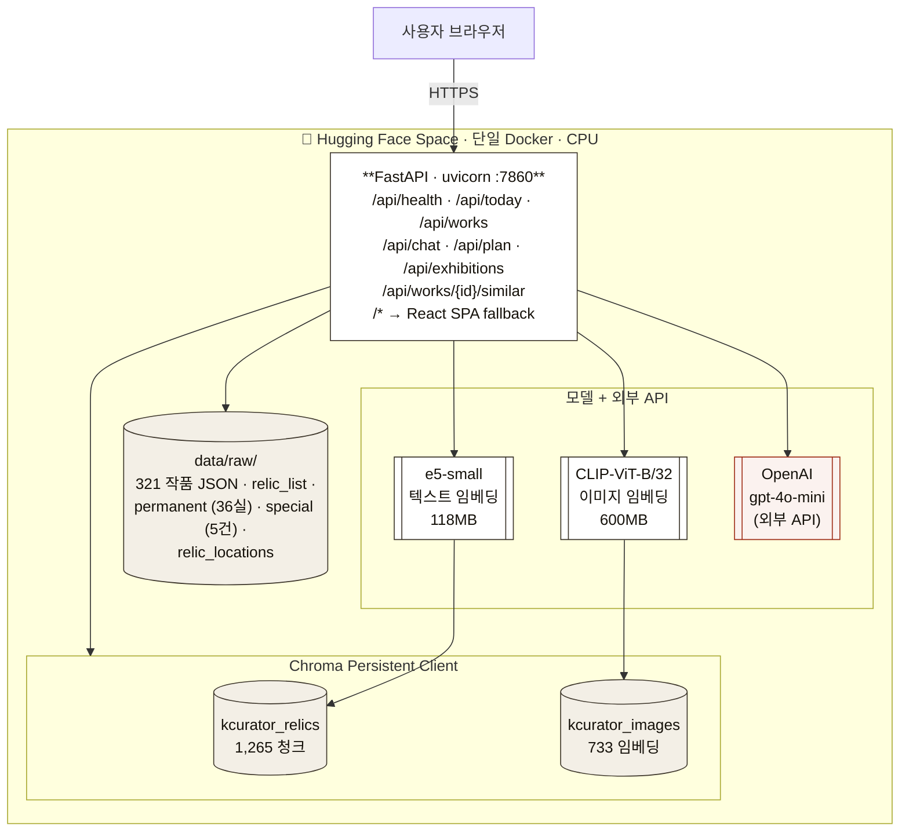
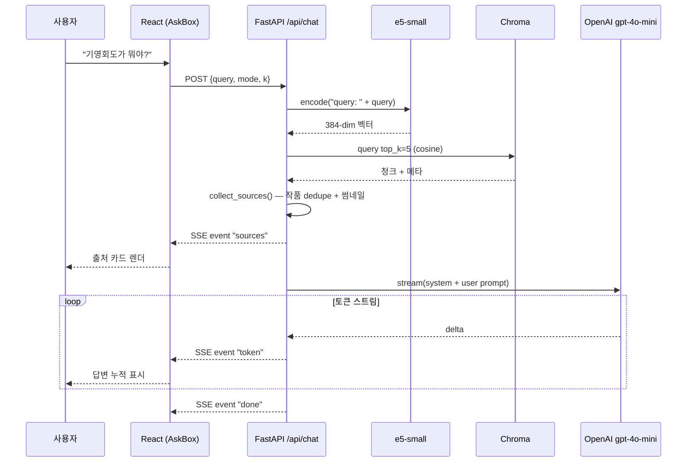

# 02. 아키텍처 (Architecture)

## 시스템 한 장 요약



## 구성 요소

### 1. 데이터 레이어
| 파일 | 내용 | 크기 |
|---|---|---|
| `data/raw/relic_*.json` | 큐레이터 추천 321점 (제목·본문·이미지·메타) | 약 4 MB |
| `data/raw/relic_list.json` | 321점의 ID·썸네일·상세 URL | 100 KB |
| `data/raw/permanent.json` | 7관 36실 + 643 작품 + 실 소개 | 200 KB |
| `data/raw/special.json` | 진행중 특별·테마전 5건 | 30 KB |
| `data/raw/relic_locations.json` | 추천↔상설 매칭 결과 (52건) | 5 KB |
| `data/chroma/kcurator_relics/` | e5-small 텍스트 임베딩 인덱스 | 약 22 MB |
| `data/chroma/kcurator_images/` | CLIP 이미지 임베딩 인덱스 | 약 10 MB |

### 2. 백엔드 (Python)

```
src/
  api.py              FastAPI 진입점, lifespan에서 모델·인덱스 로드
  rag.py              검색 → 컨텍스트 빌딩 → LLM 호출 (CLI도 가능)
  build_index.py      텍스트 청킹 + 임베딩 + Chroma 저장
  embed_images.py     이미지 다운로드 + CLIP 임베딩
  daily_pick.py       30개 테마 풀 + day-of-year 회전 로직
  search.py           CLI 검색 디버그 도구
  match_locations.py  추천 ↔ 상설 fuzzy 매칭
  scrape_one.py       작품 1점 스크래퍼 (개발용)
  scrape_list.py      321점 ID 리스트 수집
  scrape_all.py       전체 321점 자동 수집
  scrape_permanent.py 7관 36실 스크래퍼
  scrape_special.py   진행중 전시 스크래퍼
```

핵심 모듈은 단일 책임으로 분리되어 있고, 데이터 수집 → 인덱싱 → 서빙 단계가 명확히 떨어집니다.

### 3. 프론트엔드 (React)

```
frontend/
  index.html         Noto Serif/Sans KR 프리커넥트, SPA mount
  src/main.jsx       React Router 6 설정 (6개 라우트)
  src/App.jsx        Layout (Header + Outlet + Footer + ScrollRestoration)
  src/index.css      Tailwind v4 + theme tokens (paper/ink/vermilion)

  src/pages/
    Home.jsx         히어로 + 매일 큐레이션 + 더 보기 + AI CTA
    Plan.jsx         코스 빌더 (시간/동반자/관심사 폼)
    Exhibitions.jsx  특별전 카드 + 층별 상설관 트리
    Browse.jsx       321점 갤러리 + 검색 필터
    Work.jsx         큰 이미지 + 메타 + 본문 + sticky AskBox + 닮은 작품
    Ask.jsx          전체 화면 AskBox

  src/components/
    Header.jsx       사이 로고, 5-tab nav, 모바일 햄버거
    Footer.jsx       브랜드 + 라이선스
    WorkCard.jsx     썸네일 + 제목 + 큐레이터
    AskBox.jsx       3-mode 토글 + SSE 스트리밍 챗 + 출처 카드

  src/lib/api.js     fetch + SSE 파서 (\r\n\r\n / \n\n / \r\r 모두 지원)
```

## 데이터 흐름

### 사용자 챗 요청 흐름



### 빌드 시점 데이터 흐름 (Dockerfile)

```
1. node:20-slim     · npm ci → npm run build  → dist/
2. python:3.12-slim · pip install -r requirements.txt
                    · COPY src/ data/raw/
                    · COPY --from=stage1 frontend/dist
                    · python src/build_index.py    # ~3분
                    · python src/embed_images.py   # ~7분
3. CMD: uvicorn api:app --host 0.0.0.0 --port 7860
```

## 기술 스택 선택 이유

| 결정 | 대안 | 선택 사유 |
|---|---|---|
| **Vector DB**: Chroma | Qdrant, Weaviate, pgvector | 파일 기반 / 단일 컨테이너 배포 단순 / Python-native API |
| **임베딩(text)**: e5-small | bge-m3, ko-sroberta | 다국어 + 118MB로 작아 CPU/모바일 배포 적합 / `passage:`/`query:` 프리픽스 |
| **임베딩(image)**: CLIP-ViT-B-32 | clip-multilingual | 이미지 인코더 자체 지원 (multilingual은 텍스트 전용이라 1차 시도 실패) |
| **LLM**: gpt-4o-mini | Claude/Gemini | 사용자가 결제해 둔 OpenAI 크레딧 활용 / 한국어 톤 충분 / 호출당 ~$0.0008 |
| **백엔드**: FastAPI | Flask, Django | async + SSE 자연스러움 / 자동 OpenAPI 문서 / pydantic 검증 |
| **프론트**: React + Vite | Next.js | RAG 백엔드가 Python이라 Next.js의 SSR 가치 없음 / Vite 빌드 빠름 |
| **CSS**: Tailwind v4 | Chakra, MUI | 디자인 시스템 컨트롤 / 빌드 사이즈 작음 / 빠른 프로토타이핑 |
| **호스팅**: HF Spaces (Docker) | Vercel + Render | 단일 컨테이너로 프론트+백엔드 같이 / 무료 / ML 모델 친화적 |
| **빌드 패턴**: 모델·인덱스 이미지에 베이크 | 런타임 다운로드 | cold start 30초 vs 5분 차이 / 결정성 |

## 보안 / 비용 / 성능

### 보안
- API 키(`OPENAI_API_KEY`)는 HF Space "Repository secrets"로 주입, 코드에 없음
- `.env`는 `.gitignore`로 제외
- CORS는 `CORS_ORIGINS` 환경변수로 화이트리스트 (default localhost)
- 챗 엔드포인트 인증 없음 — 시연 데모라 OK, 트래픽 시 rate-limit 추가 필요

### 비용
- HF Space 무료 (CPU basic, 16GB RAM)
- OpenAI: 호출당 ~$0.0008 (gpt-4o-mini, 입력 3k tok + 출력 500 tok)
- 1,000회 챗 ≈ $0.8
- 데모 수준에선 거의 무료

### 성능
- 콜드 스타트: 약 25~30초 (모델 메모리 로드)
- 워밍 후 챗 응답 시작까지: ~1.5초 (검색 0.3s + LLM 첫 토큰 ~1s)
- 토큰 스트리밍 속도: gpt-4o-mini 기준 한국어 ~80 token/s 체감
- 이미지 유사도 검색: ~50ms

## 모듈 의존성 그래프

```
api.py
 ├─ rag.py
 │   └─ build_index.py   (CHROMA_DIR, COLLECTION 등 상수)
 ├─ daily_pick.py        (테마 풀 + 회전)
 ├─ chromadb             (PersistentClient)
 ├─ sentence_transformers (e5-small + CLIP)
 ├─ openai               (chat.completions stream)
 └─ sse_starlette        (EventSourceResponse)

build_index.py / embed_images.py
 └─ data/raw/*.json (입력)
 └─ data/chroma/   (출력)
```
